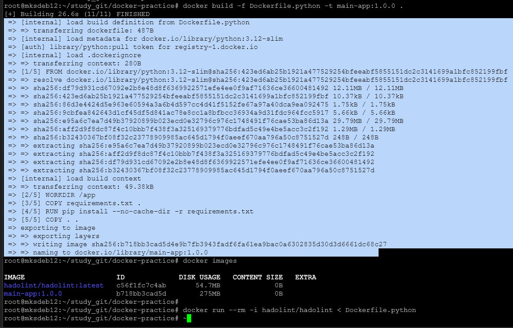
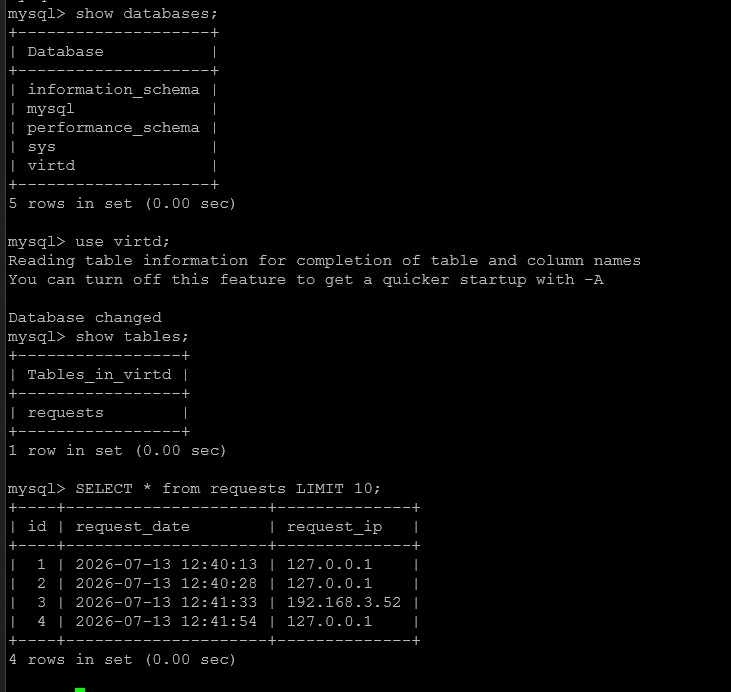
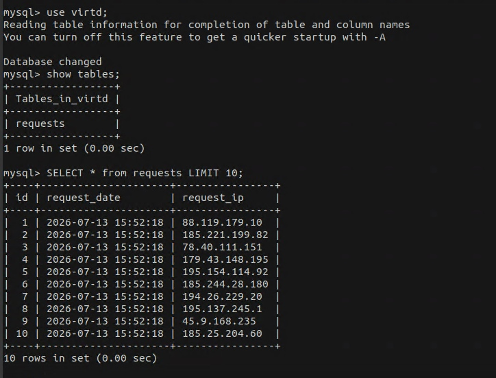
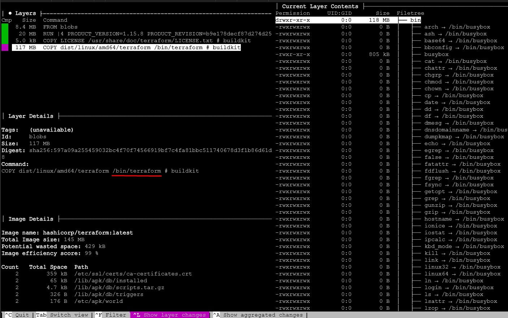
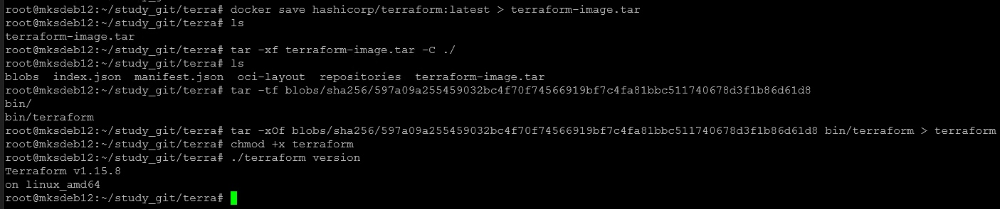

Домашнее задание к занятию 5. «Практическое применение Docker». Милованов К.С.

## Ответ 1:



## Ответ 3:



## Ответ 4:


## Ответ 6:

```
wget https://github.com/wagoodman/dive/releases/download/v0.13.1/dive_0.13.1_linux_amd64.deb
apt install ./dive_0.13.1_linux_amd64.deb
docker pull hashicorp/terraform:latest
dive hashicorp/terraform:latest
```

```
docker save hashicorp/terraform:latest > terraform-image.tar

tar -xf terraform-image.tar -C ./

 # файловые системы слоев в blobs/sha256/ являются tar-архивами:
tar -xOf blobs/sha256/597a09a255459032bc4f70f74566919bf7c4fa81bbc511740678d3f1b86d61d8 bin/terraform > terraform
```

